[toc]

[Learn git visual](https://learngitbranching.js.org) 

## Config - configurations

The global config file
```bash
~/.gitconfig
```

Project config
```bash
/project/.git/config
```

## Init a git in a project

```bash
# cd to the project root directory

# run this
git init
```

## `git status` - show working tree status

Once create, modify, delete the files, see the status by
```bash
git status
```

Output
```
On branch main
Your branch is up to date with 'origin/main'.

Changes not staged for commit:
  (use "git add <file>..." to update what will be committed)
  (use "git restore <file>..." to discard changes in working directory)
	modified:   git/basic_git.md

Untracked files:
  (use "git add <file>..." to include in what will be committed)
	basic_bash_tutorial.sh

no changes added to commit (use "git add" and/or "git commit -a")
```

Git is aware of the changes, the tree has 2 status:
- Untracked: Once modify, git knows you change, but you havn't said "hey I want this to commit"
- Tracked: You add the files you want to commit, and git knows it

When you first add files to an empty repository, they are all untracked. To get Git to track them, you need to stage them, or add them to the staging environment.

## Git staging environment

> One of the core functions of Git is the concepts of the Staging Environment, and the Commit.

As you are working, you may be *adding, editing and removing files*. But whenever you hit a milestone or finish a part of the work, you should **add the files to a Staging Environment.**

### `git add [<options>]`Add the files

```bash
# add one file
git add thisFile.txt

# to add all files
git add -all # or use -A
```

#### Use `git add -A` over `git add .`

`git add -A` staging *new, modify, delete*

`git add .` staging *new, modify*, not **delete**. Also, sub-directory not works in some versions.

Overall, I'd say `git add -A` is a safer option.


## Commit to repo - git considers "save point"

Adding commits keep track of our progress and changes as we work.

**Note:** always add message to commits

- `-a`: commit all files. (omit stagig, commit all. Sometimes it's tedious to use git add for small changes. but it's recommended to seperate staging and commit)
- `-m`: message

---

Example: **We was on C1 commit** 
```bash
git commit
```
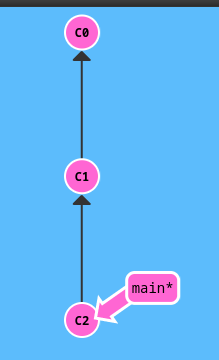 

## Branch

### List branches

Show local branches
```bash
git branch

# now only 1 branch
# it shows which branch you're on
# output:
* main
```

Show all branches, include remote
```bash
git branch -a
```

### new branch 

```bash
git branch <name>
```
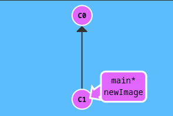 

### `git checkout <branch>`- change branch 

```bash
git checkout <name>
```

### create a new branch and check it out

It can be shorthand:
```bash
git checkout -b <name>
```

### Create new branch, modify, and push to remote

When push to remote repository, you don't push to main, **you push to `<newBranch>`.** 
```bash
# new branch
git branch bugFix

# now on new branch
git checkout bugFix

# modify file by vim
vim README.md

# add and commit
git add .
git commit -m 'bug branch'

# push to remote bugFix branch!
git push origin bugFix
```

## merge

**Now we are working on main branch** 

We are going to merge the branch `bugFix` into `main`

```bash
git merge bugFix
```

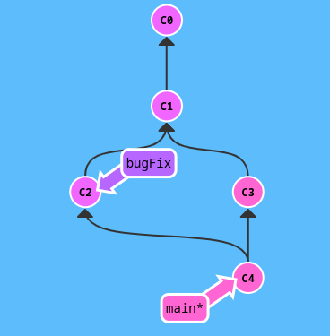 

### merge conflict

Scenario: There are 2 branches, `main` and `feature`. They both modify the `App.java`. While on `main` branch runnning `git merge feature`:

```bash
[derry@fed-x1 playg]$ git merge feature_class 
Auto-merging sandbox/src/main/java/org/example/App.java
CONFLICT (content): Merge conflict in sandbox/src/main/java/org/example/App.java
Automatic merge failed; fix conflicts and then commit the result.
```
The merge conflics appeared. Message says it's in `App.java`. It also show on `git status`
```bash
[derry@fed-x1 playg]$ git status
On branch main
You have unmerged paths.
  (fix conflicts and run "git commit")
  (use "git merge --abort" to abort the merge)

Unmerged paths:
  (use "git add <file>..." to mark resolution)
	both modified:   sandbox/src/main/java/org/example/App.java

no changes added to commit (use "git add" and/or "git commit -a")
```

open the `App.java`, and the file has been modified by git:
```java
public class App {
    public static void main(String[] args) {
        System.out.println("Hello World!");
<<<<<<< HEAD
        System.out.println("I'm the world in main branch");
=======
        System.out.println("This is the feature message in feature branch");
>>>>>>> feature_class
    }
}
```

Now we're on branch `main`, it's not possible to checkout another branch.
```bash
[derry@fed-x1 playg]$ git checkout feature_class 
sandbox/src/main/java/org/example/App.java: needs merge
error: you need to resolve your current index first
```

Now, resolve the conflict by modifying the `App.java`
```java
public class App {
    public static void main(String[] args) {
        System.out.println("Hello World!");
        System.out.println("I'm the world in main branch");
    }
}
```

Now `add` and commit the change.
```bash
# after modify
git add -A
git commit -m "resolve the conflict"

# then 
[derry@fed-x1 playg]$ git status
On branch main
nothing to commit, working tree clean

```

## rebase

**Note that the branch we are on, will 'change the base' to another branch.** 

Request: Move work directly from bugFix onto `main` branch 

**We are on bugFix branch** 

```bash
git rebase main
```

Before rebase

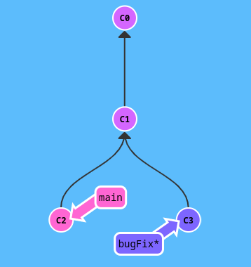 

After rebase

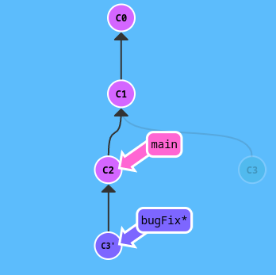 

Now we know `bugFix` is ahead of `main` branch so we have to merge `main` branch with `bugFix` branch as well

```bash
git rebase bugFix
```

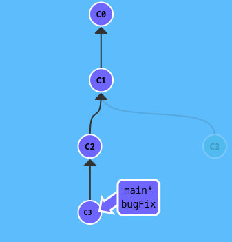 

Since `main` was an ancestor of `bugFix`, `git` simply moved the `main` reference forward in history.

### rebase \<branch1> \<branch2>

**We are on main branch.**

```bash
git rebase main bugFix
```

### rebase interactive `-i`

Open up a text editor, show which commits are about to be copied below the target rebase. It also shows their commit hashes and message.

```bash
git rebase -i HEAD~4
```

## `git diff` - show difference between 2 commits

```bash
# the "^" means the previous one
git diff HEAD^ HEAD
```

## Log

```bash
git log
```

Output:
```bash
commit 07279a6b73e4b95968c77d82f655ee58f4602437
Author: derrykid <derry.yeh.dev@gmail.com>
Date:   Fri Aug 11 13:48:31 2023 +0800

    update git tutorial

commit c1504f0f9e7c4a1fbf4fec7718da78db900c5b93
Author: derrykid <derry.yeh.dev@gmail.com>
Date:   Wed Aug 9 10:49:59 2023 +0800

    push
```
The log message shows clearly the author, date, and commit message. **The commit message is very important to know what has been done.**

## HEAD

What is HEAD? HEAD is the work in action. Simply put: what you're doing now is the `HEAD`. Once you commit, the HEAD becomes the branch commit you work on.

Let's see where the `HEAD` is hiding:
```bash
git checkout C2
```

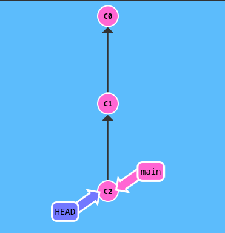 


## relative refs

- Moving upwards one commit `^`
- Moving upwards a number of times `~<num>`


```bash
git checkout main^
```
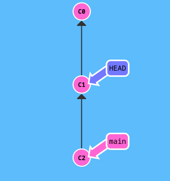 

Move 2 times 
```bash
git checkout HEAD~2
```

### branch forcing

You can directly reassign a branch to a commit with `-f` flag

**On bugFix branch, main was on C4 commit.** 

```bash
git branch -f main HEAD~3
```

After 

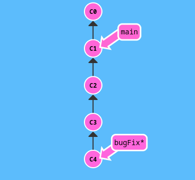 

Reassign a branch `main` to a hash commit, e.g. `C6` commit

```bash
git branch -f main C6
```

## Reset

**Works for local machine** 

`git reset` reverses changes by moving a branch reference backwards in time to an older commit, i.e. *rewriteing history*

```bash
git reset HEAD~1
```

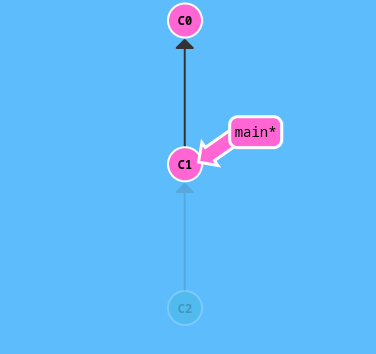 

## Revert

In order to reverse changes and share those reversed changes with others, use `git revert`

```bash
git revert HEAD
```

**A new commit plopped down below the commit we wanted to reverse.** This new commit introduces changes - reverse the commit

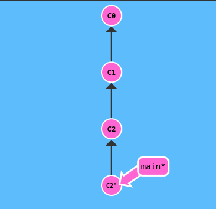 

## git cherry-pick \<Commit1> \<Commit2> \<...>

Copy a series of commits below your current location `HEAD`. **As long as that commit isn't an ancestor of HEAD.** 

Suppose we are on `main`, and we want `C2`, and `C4` commits.

```bash
git cherry-pick C2 C4
```

This will plop down the `main` branch twice

Before

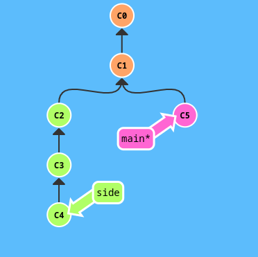 

After 

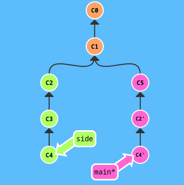 

## git tag \<tagname> \<Commit>

Tag is used to permanently mark a historical points in the history. It works as an anchor.


```bash
git tag v1 C1
```

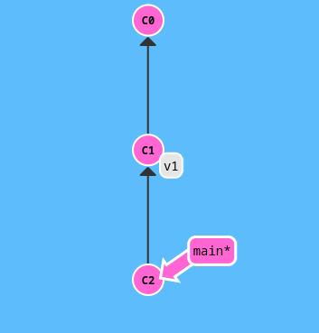 

## git describe \<ref>

output: `<tag>_<numCommits>_g<hash>`, the hash is where the branch on

```bash
git describe main
```

## git clone

`origin/main` is called remote branch. When you check them out, you're put into detached `HEAD` mode. Git does this on purpose because you can't work on these branches directly.

To be clear: Remote branches are on your local repository, not on the remote repository.

## git fetch

Fetch data from the remote repository

For example, when working on your local codebase, the remote repository has updated and committed few times. In order to **download these commits**, you can use `git fetch` to update your `origin/main`. 

**This update our local `remote branch`** into synchronization with what the actual remote repository looks like now. **It doesn't change anything about your local state.** You have to use `git merge origin/main` to merge the code.

```bash
git fetch
```

Don't need to put any other arguments to it.

### git fetch \<source>:\<destination>

Works like `git push origin main` while it's on opposite direction

## git pull - combination of `fetch, merge`

Often, when you `git fetch`, you'd like to merge it with your local `origin/main`:

Use one of the following:

- `git merge origin/main`
- `git rebase origin/main`
- `git cherry-pick origin/main`

```bash
git fetch
git merge origin/main
```

And `git` provides a shorthand for it `git pull`

```bash
git pull
```

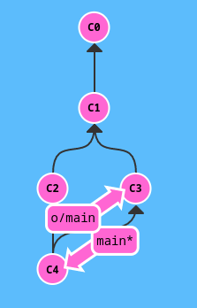 

## git push

`git push` is responsible for uploading your changes to a specified remote and updating that remote to incorporate your new commits. You can think of `git push` as a command to "publish" your work.

```bash
git push
```

### git push \<remote> \<place>

The <place> is what branch locally we like to commit to remote. For example, `git push origin main`, we simply tell `git` that we want the local `main` branch to push to remote origin `main`.

```bash
git push origin main
```

**Note that we don't have to use `origin/main`, simply `origin`** 

### git push origin \<source>:\<destination>

`<source>` is where you specify your commit, e.g. C1, C2, etc.

`<destination>` is the remote branch name

Before git push

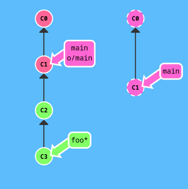 

```bash
git push origin foo^:main
```

After:

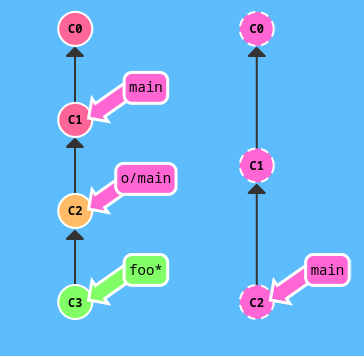 


### Real word example of `git push`

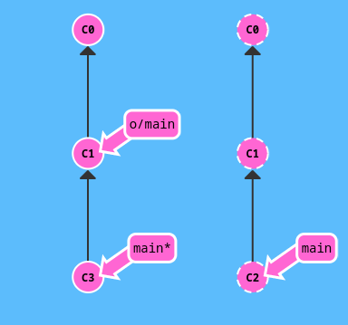 

The image above, you cannot `git push` because your local repository is on `C3` while the remote repository is on `C2`.

It's common for team project. You work on your allocated part and others work on theirs.

Now, how do we push our work to remote repository?

### git force push

```bash
git push -f <remote> <branch>
```

####  Use rebase

1. git fetch
2. git rebase origin/main
3. git push

The result:

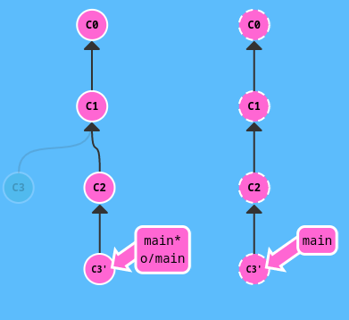 


#### Use merge

```bash
git fetch
git merge origin/main
git push
```

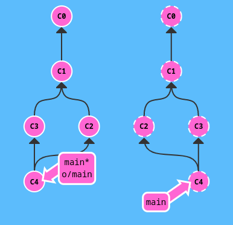 

#### Use `git pull` shorthand

Tired of typing so many commands? Use `git pull` !

`git pull` is shorthand for a fetch and merge. Optionally, you can use `git pull --rebase` for a fetch and a rebase

```bash
git pull --rebase
git push
```

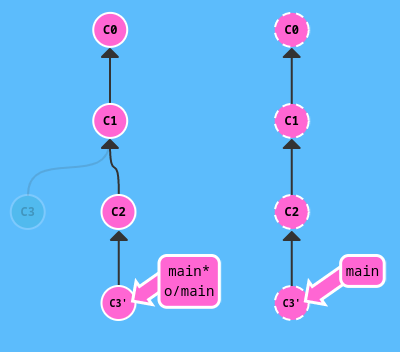 

Alternatively, use merge

```bash
git pull
git push
```

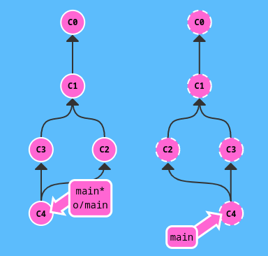 

## remote tracking

Name a different branch to push to remote `main`

```bash
git checkout -b totallyNotMain origin/main
```

Another way to set remote tracking on a branch is to simply use `git branch -u`
```bash
git branch -u o/main totallyNotMain
```

If `totallyNotMain` is checked out, it can be shorter:
```bash
git branch -u origin/main
```
