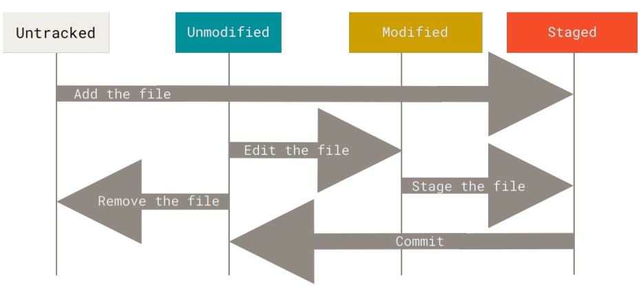

## Concepts to know before using git 

Git stores the file as snapshot in the *local database*. 

In git, there are 3 states:

1. Modified: you have changed the file but have not committed it to your database yet
2. Staged: you have marked a modified file in its current version to go into your next commit snapshot
3. commited: the data is safely stored in your local database


## git config

### Identity

Check the repository identity
```bash
git config --list --show-origin
```

Here is the commands to change
- user.name
- user.email
- default branch

```bash
git config --global user.name "Derry"
git config --global user.email joe.doe@example.com
git config --global init.defaultBranch main
```

If need to set this identity for a specific repository, i.e. you are in a repository and you don't want to use this global config, simply skip `--global` flag.

### Global editor 

Change the editor by
```bash
git config -- global core.editor vim
```

## help

```
git <verb> help
git commit help
```

## How to think of `git add`? 

It may be helpful to think of it more as "add precisely this content to the next commit" rather than "add this file to the project".
## Working with repository

### How to create a local repository

#### Init a local repository 

In the directory and existing project:
```bash
git init
```

#### Cloning a repository 

```bash
git clone <url>
git clone https://www.github.com/someproject
```


### Recording changes to your repository

All files in the repository can be one of two states: *tracked* and *untracked*. 

*Tracked files* are files that were in the last snapshot; they can be *unmodified, modified, or staged*. In short, *tracked files are files that Git knows about.*

*Untracked files are everything else* — any files in your working directory that were not in your last snapshot and are not in your staging area


### Checking status of your repository 

**No changes**

```bash
$ git status
On branch main

No commits yet

nothing to commit (create/copy files and use "git add" to track)
```

The output shows what branches you're on and if there's modifications made in the repository.

---

**Changes made**:

1. Create a file `README` with content `Hello World`
2. check the `git status`

```bash
$ echo "Hello World" > README
$ git status
On branch main

No commits yet

Untracked files:
  (use "git add <file>..." to include in what will be committed)
	README

nothing added to commit but untracked files present (use "git add" to track)
```

*Untracked files* means that Git sees a file you didn't have in the previous snapshot (commit), and which hasn’t yet been staged


### Tracking new files: staged 

From the previous section, we created a file `README` and now we're going to *stage* the change by `git add`

```bash 
$ git add README
$ git status
On branch main

No commits yet

Changes to be committed:
  (use "git rm --cached <file>..." to unstage)
	new file:   README
```

The file is now tracked and ready for `git commit`

--- 

Another situation: If there's file in the last commit, and also there is a file not existed in the last commit.

```bash 
$ git add .
$ git status
On branch main
Your branch is up to date with 'origin/main'.

Changes to be commited:
  (use "git reset HEAD <file>..." to unstage)
  
    modified:   new_post.py

Untracked files:
  (use "git add <file>..." to include in what will be committed)
	sites/quickstart/

no changes added to commit (use "git add" and/or "git commit -a")
```

We see *changes to be commited* and *Untracked files* section. Run `git add` will add both files to be staged and ready to commit.


### Ignore files 

Keep the files or directory you want to ignore in `.gitignore`
```
*.tmp
target/
```


### Checking the difference 

`git status` only shows what's been tracked, untracked, modified. `git diff` shows exactly the lines added or removed.

- `git diff`: compares what is in your working directory with what is in your staging area.
- `git diff --staged` (or `git diff --cached` both are synonyms): compares your staged changes to your last commit (in other words, what's staged but not commited)

---

1. Create a `README` with content "Hello World"
2. `git add README`
3. use `git diff --staged` to see what's staged but not committed (in other words, compares to the last commit)

```bash
$ git diff --staged
diff --git a/README b/README
new file mode 100644
index 0000000..557db03
--- /dev/null
+++ b/README
@@ -0,0 +1 @@
+Hello World
```


### Commit your changes 

```bash
$　git commit

# after adding the messages 

[main (root-commit) 288f9f3] adding new file README
 1 file changed, 1 insertion(+)
 create mode 100644 README
```

This will pop up the default text editor of your machine.  Add the commit messages to it and save and exit.

```bash
$ git commit -m "Inline commit messages"
```

Every time you perform a commit, you’re recording a snapshot of your project that *you can revert to or compare to later.*


### Remove files from repository 

To remove a file from git repository, you have to *remove* it from tracked files and *commit* it.

- `git rm <file>` 

```bash 
$ git rm README 
rm 'README'

$ git status
On branch main
Changes to be committed:
  (use "git restore --staged <file>..." to unstage)
	deleted:    README

$ git commit -m 'rm readme'
[main cfe54f1] rm readme
 1 file changed, 1 deletion(-)
 delete mode 100644 README
```

If you *modified the file or had already added it to the staging* area, you must *force the removal* with the `-f` option


#### Remove files from the staging area 

This is particularly useful if you forgot to add something to your `.gitignore` file and accidentally staged it, like a large log file or a bunch of .a compiled files.

- `git rm --cached <file>`

```bash
# new file readme_v2

$ git status
On branch main
Changes to be committed:
  (use "git restore --staged <file>..." to unstage)
	new file:   readme_v2

$ git rm --cached readme_v2 
rm 'readme_v2'
[derry@fed-x1 playg]$ git status
On branch main
Untracked files:
  (use "git add <file>..." to include in what will be committed)
	readme_v2

nothing added to commit but untracked files present (use "git add" to track)

```


#### Unstaged a stage file 

Since git 2.24, `git restore --staged <file>` is recommended instead of `git reset HEAD <file>`.

```bash
$ git status
On branch main
Your branch and 'origin/main' have diverged,
and have 1 and 1 different commits each, respectively.
  (use "git pull" if you want to integrate the remote branch with yours)

Changes to be committed:
  (use "git restore --staged <file>..." to unstage)
	modified:   git/git101.md

$ git restore --staged git/git101.md 

$ git status
On branch main
Your branch and 'origin/main' have diverged,
and have 1 and 1 different commits each, respectively.
  (use "git pull" if you want to integrate the remote branch with yours)

Changes not staged for commit:
  (use "git add <file>..." to update what will be committed)
  (use "git restore <file>..." to discard changes in working directory)
	modified:   git/git101.md

no changes added to commit (use "git add" and/or "git commit -a")

```

### Unmodify a modify file 

Any local changes you made to that file are gone

- `git restore <file>`

```bash 
$ git restore git/git101.md
```
## Viewing the commit history

- `git log` shows the commit history in reverse chronological order
- Use `git log --patch -<number>` to show the difference in each commit. `git log --patch -2` shows recent 2 commits
- `git log --stat` for a summary of files statistics
- `git log --no-merges` for not showing merges log

Other useful to read the git log:
- `git log --pretty=<oneline/short/full>` to shows the git logs
- `git log --graph`, you can combine with `--pretty`

|Option|Description|
|-|-|
|`--since,--after`|Limit the commits to those made after the specified date.|
|`--until, --before`|Limit the commits to those made before the specified date.|
|`--author`|shows the matched author.|
|`--commiter`|shows the matched committer|

---

```bash
$ git log
commit aafc1f3d127318805bfb6775d2fafc28a61540e3 (HEAD -> main, origin/main, origin/HEAD)
Author: derrykid <derry.career@pm.me>
Date:   Wed Dec 20 18:20:42 2023 +0800

    update git learning notes

commit 852ca297248ffab1044af27756452e2ad7c20db5
Author: derrykid <derry.yeh.dev@gmail.com>
Date:   Fri Aug 11 17:24:50 2023 +0800

    git tut
```


`git log --patch -2` shows the changes:
```bash
$ git log -p -2  # git log --patch -2
commit aafc1f3d127318805bfb6775d2fafc28a61540e3 (HEAD -> main, origin/main, origin/HEAD)
Author: derrykid <derry.career@pm.me>
Date:   Wed Dec 20 18:20:42 2023 +0800

    update git learning notes

diff --git a/git/git101.md b/git/git101.md
new file mode 100644
index 0000000..a3779a1
--- /dev/null
+++ b/git/git101.md
@@ -0,0 +1,266 @@
+## Concepts to know before using git 
+
+Git stores the file as snapshot in the *local database*. 
```

`git log --stat` shows the abbreviated stats:
```bash 
$ git log --stat -1
commit aafc1f3d127318805bfb6775d2fafc28a61540e3 (HEAD -> main, origin/main, origin/HEAD)
Author: derrykid <derry.career@pm.me>
Date:   Wed Dec 20 18:20:42 2023 +0800

    update git learning notes

 git/git101.md        | 266 +++++++++++++++++++++++++++++++
 git/images/image.png | Bin 0 -> 48889 bytes
 2 files changed, 266 insertions(+)
```

### Log graph example 

Here combines `--pretty=oneline --graph` . I only have one branch, so looks like this:
```bash
git log --pretty=oneline --graph
* 6775d2fafc28a61540e3 update git learning notes
* f27756452e2ad7c20db5 git tut
* 05f67e63db2690389961 update git branch notes
* 7d82f655ee58f4602437 update git tutorial
* ec7718da78db900c5b93 push
```