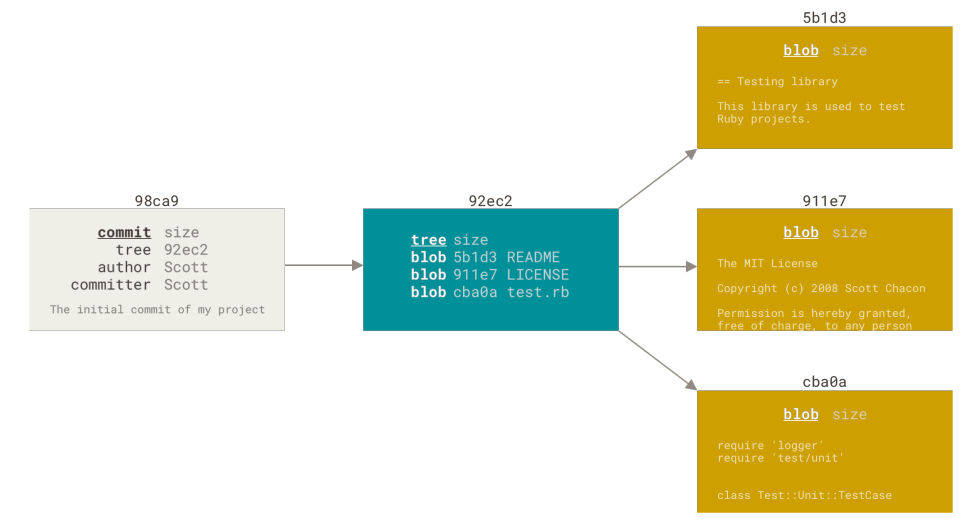
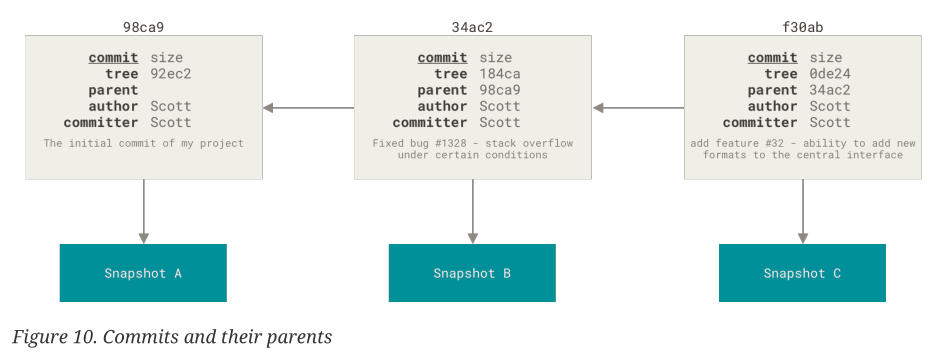
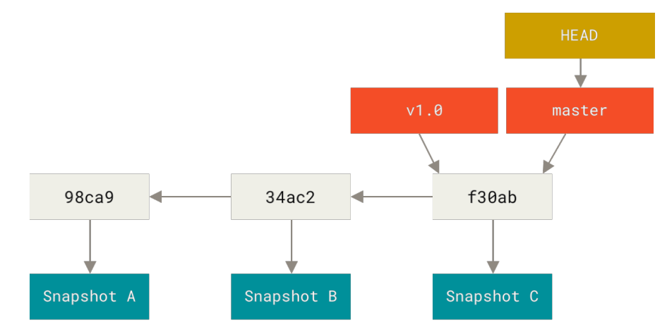
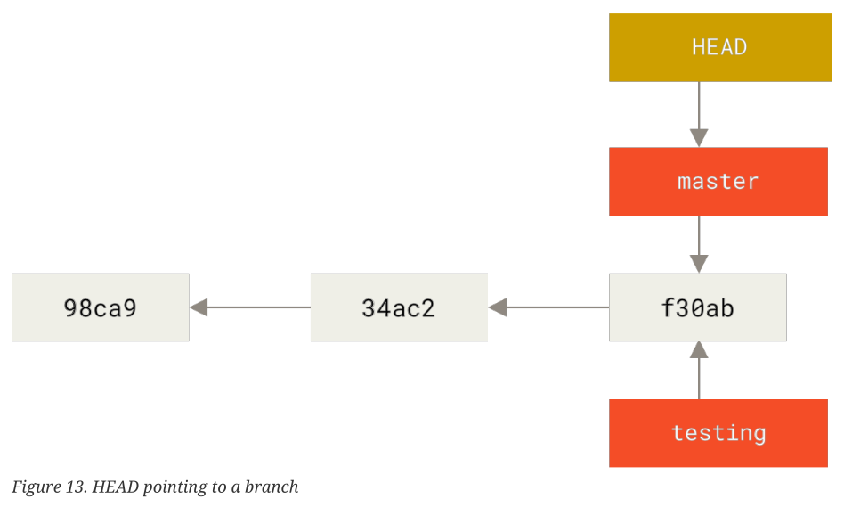
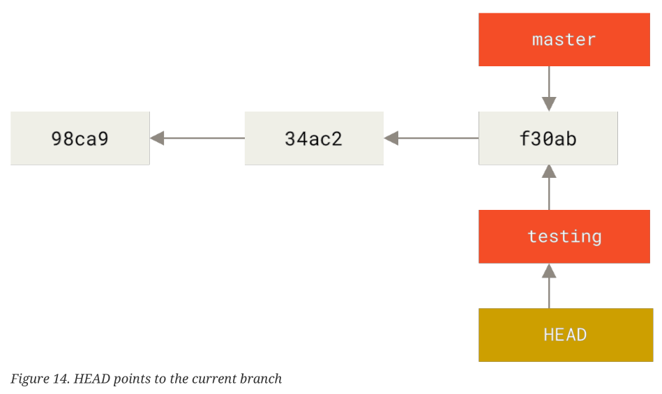
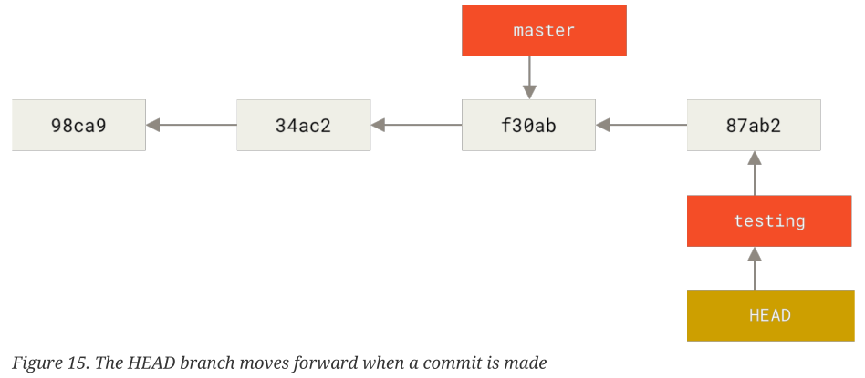

---
~
---
# Git Basics
## Concepts to know before using git 

Git stores the file as snapshot in the *local database*. 

In git, there are 3 states:

1. Modified: you have changed the file but have not committed it to your database yet
2. Staged: you have marked a modified file in its current version to go into your next commit snapshot
3. commited: the data is safely stored in your local database


## git config

### Identity

Check the repository identity
```bash
git config --list --show-origin
```

Here is the commands to change
- user.name
- user.email
- default branch

```bash
git config --global user.name "Derry"
git config --global user.email joe.doe@example.com
git config --global init.defaultBranch main
```

If need to set this identity for a specific repository, i.e. you are in a repository and you don't want to use this global config, simply skip `--global` flag.

### Global editor 

Change the editor by
```bash
git config -- global core.editor vim
```

## help

```
git <verb> help
git commit help
```

## How to think of `git add`? 

It may be helpful to think of it more as "add precisely this content to the next commit" rather than "add this file to the project".
## Working with repository

### How to create a local repository

#### Init a local repository 

In the directory and existing project:
```bash
git init
```

#### Cloning a repository 


```bash
git clone <url>
git clone https://www.github.com/someproject
```

- `git clone` command automatically sets up your local main branch to track the remote main branch


### Recording changes to your repository

All files in the repository can be one of two states: *tracked* and *untracked*. 

*Tracked files* are files that were in the last snapshot; they can be *unmodified, modified, or staged*. In short, *tracked files are files that Git knows about.*

*Untracked files are everything else* — any files in your working directory that were not in your last snapshot and are not in your staging area


### Checking status of your repository 

**No changes**

```bash
$ git status
On branch main

No commits yet

nothing to commit (create/copy files and use "git add" to track)
```

The output shows what branches you're on and if there's modifications made in the repository.

---

**Changes made**:

1. Create a file `README` with content `Hello World`
2. check the `git status`

```bash
$ echo "Hello World" > README
$ git status
On branch main

No commits yet

Untracked files:
  (use "git add <file>..." to include in what will be committed)
	README

nothing added to commit but untracked files present (use "git add" to track)
```

*Untracked files* means that Git sees a file you didn't have in the previous snapshot (commit), and which hasn’t yet been staged


### Tracking new files: staged 

From the previous section, we created a file `README` and now we're going to *stage* the change by `git add`

```bash 
$ git add README
$ git status
On branch main

No commits yet

Changes to be committed:
  (use "git rm --cached <file>..." to unstage)
	new file:   README
```

The file is now tracked and ready for `git commit`

--- 

Another situation: If there's file in the last commit, and also there is a file not existed in the last commit.

```bash 
$ git add .
$ git status
On branch main
Your branch is up to date with 'origin/main'.

Changes to be commited:
  (use "git reset HEAD <file>..." to unstage)
  
    modified:   new_post.py

Untracked files:
  (use "git add <file>..." to include in what will be committed)
	sites/quickstart/

no changes added to commit (use "git add" and/or "git commit -a")
```

We see *changes to be commited* and *Untracked files* section. Run `git add` will add both files to be staged and ready to commit.


### Ignore files 

Keep the files or directory you want to ignore in `.gitignore`
```
*.tmp
target/
```


### Checking the difference 

`git status` only shows what's been tracked, untracked, modified. `git diff` shows exactly the lines added or removed.

- `git diff`: compares what is in your working directory with what is in your staging area.
- `git diff --staged` (or `git diff --cached` both are synonyms): compares your staged changes to your last commit (in other words, what's staged but not commited)

---

1. Create a `README` with content "Hello World"
2. `git add README`
3. use `git diff --staged` to see what's staged but not committed (in other words, compares to the last commit)

```bash
$ git diff --staged
diff --git a/README b/README
new file mode 100644
index 0000000..557db03
--- /dev/null
+++ b/README
@@ -0,0 +1 @@
+Hello World
```


### Commit your changes 

```bash
$　git commit

# after adding the messages 

[main (root-commit) 288f9f3] adding new file README
 1 file changed, 1 insertion(+)
 create mode 100644 README
```

This will pop up the default text editor of your machine.  Add the commit messages to it and save and exit.

```bash
$ git commit -m "Inline commit messages"
```

Every time you perform a commit, you’re recording a snapshot of your project that *you can revert to or compare to later.*


### Remove files from repository 

To remove a file from git repository, you have to *remove* it from tracked files and *commit* it.

- `git rm <file>` 

```bash 
$ git rm README 
rm 'README'

$ git status
On branch main
Changes to be committed:
  (use "git restore --staged <file>..." to unstage)
	deleted:    README

$ git commit -m 'rm readme'
[main cfe54f1] rm readme
 1 file changed, 1 deletion(-)
 delete mode 100644 README
```

If you *modified the file or had already added it to the staging* area, you must *force the removal* with the `-f` option


#### Remove files from the staging area 

This is particularly useful if you forgot to add something to your `.gitignore` file and accidentally staged it, like a large log file or a bunch of .a compiled files.

- `git rm --cached <file>`

```bash
# new file readme_v2

$ git status
On branch main
Changes to be committed:
  (use "git restore --staged <file>..." to unstage)
	new file:   readme_v2

$ git rm --cached readme_v2 
rm 'readme_v2'
[derry@fed-x1 playg]$ git status
On branch main
Untracked files:
  (use "git add <file>..." to include in what will be committed)
	readme_v2

nothing added to commit but untracked files present (use "git add" to track)

```


#### Unstaged a stage file 

Since git 2.24, `git restore --staged <file>` is recommended instead of `git reset HEAD <file>`.

```bash
$ git status
On branch main
Your branch and 'origin/main' have diverged,
and have 1 and 1 different commits each, respectively.
  (use "git pull" if you want to integrate the remote branch with yours)

Changes to be committed:
  (use "git restore --staged <file>..." to unstage)
	modified:   git/git101.md

$ git restore --staged git/git101.md 

$ git status
On branch main
Your branch and 'origin/main' have diverged,
and have 1 and 1 different commits each, respectively.
  (use "git pull" if you want to integrate the remote branch with yours)

Changes not staged for commit:
  (use "git add <file>..." to update what will be committed)
  (use "git restore <file>..." to discard changes in working directory)
	modified:   git/git101.md

no changes added to commit (use "git add" and/or "git commit -a")

```

### Unmodify a modify file 

Any local changes you made to that file are gone

- `git restore <file>`

```bash 
$ git restore git/git101.md
```
## Viewing the commit history

- `git log` shows the commit history in reverse chronological order
- Use `git log --patch -<number>` to show the difference in each commit. `git log --patch -2` shows recent 2 commits
- `git log --stat` for a summary of files statistics
- `git log --no-merges` for not showing merges log

Other useful to read the git log:
- `git log --pretty=<oneline/short/full>` to shows the git logs
- `git log --graph`, you can combine with `--pretty`

|Option|Description|
|-|-|
|`--since,--after`|Limit the commits to those made after the specified date.|
|`--until, --before`|Limit the commits to those made before the specified date.|
|`--author`|shows the matched author.|
|`--commiter`|shows the matched committer|

---

```bash
$ git log
commit aafc1f3d127318805bfb6775d2fafc28a61540e3 (HEAD -> main, origin/main, origin/HEAD)
Author: derrykid <derry.career@pm.me>
Date:   Wed Dec 20 18:20:42 2023 +0800

    update git learning notes

commit 852ca297248ffab1044af27756452e2ad7c20db5
Author: derrykid <derry.yeh.dev@gmail.com>
Date:   Fri Aug 11 17:24:50 2023 +0800

    git tut
```


`git log --patch -2` shows the changes:
```bash
$ git log -p -2  # git log --patch -2
commit aafc1f3d127318805bfb6775d2fafc28a61540e3 (HEAD -> main, origin/main, origin/HEAD)
Author: derrykid <derry.career@pm.me>
Date:   Wed Dec 20 18:20:42 2023 +0800

    update git learning notes

diff --git a/git/git101.md b/git/git101.md
new file mode 100644
index 0000000..a3779a1
--- /dev/null
+++ b/git/git101.md
@@ -0,0 +1,266 @@
+## Concepts to know before using git 
+
+Git stores the file as snapshot in the *local database*. 
```

`git log --stat` shows the abbreviated stats:
```bash 
$ git log --stat -1
commit aafc1f3d127318805bfb6775d2fafc28a61540e3 (HEAD -> main, origin/main, origin/HEAD)
Author: derrykid <derry.career@pm.me>
Date:   Wed Dec 20 18:20:42 2023 +0800

    update git learning notes

 git/git101.md        | 266 +++++++++++++++++++++++++++++++
 git/images/image.png | Bin 0 -> 48889 bytes
 2 files changed, 266 insertions(+)
```

### Log graph example 

Here combines `--pretty=oneline --graph` . I only have one branch, so looks like this:
```bash
git log --pretty=oneline --graph
* 6775d2fafc28a61540e3 update git learning notes
* f27756452e2ad7c20db5 git tut
* 05f67e63db2690389961 update git branch notes
* 7d82f655ee58f4602437 update git tutorial
* ec7718da78db900c5b93 push
```


## Working with remote 

| Options | Description|
|-|-|
|`git remote -v` | shows the repo |
|`git remote show <remote>` | shows more info on remote, e.g. branches, pull, fetch info |
|`git remote add <url>` | add new remote repository |
|`git fetch` | fetch remote changes |
|`git pull` | fetch remote changes and merge |
|`git push <remote> <branch>` |commits push to remote|

### Show remote repository 

- `git remote -v` show the repositories

```bash
$ git remote 
origin 

$ git remote -v  # git remote --verbose
origin	git@github.com:derrykid/cli-tools.git (fetch)
origin	git@github.com:derrykid/cli-tools.git (push)

```

### Inspecting a remote 

- `git remote show <remote>` to see more information about a particular remote

It shows remote branches, and which *remote branches you have that have been removed from the server*, and *multiple local branches that are able to merge automatically* when run `git pull`

```bash
$ git remote show origin
* remote origin
  Fetch URL: git@github.com:derrykid/cli-tools.git
  Push  URL: git@github.com:derrykid/cli-tools.git
  HEAD branch: main
  Remote branches:
    main                      tracked
    refs/remotes/origin/miain stale (use 'git remote prune' to remove)
  Local branch configured for 'git pull':
    main merges with remote main
  Local ref configured for 'git push':
    main pushes to main (local out of date)
```

### Add remote repository 

- `git remote add <shortname> <url>`
```bash
$ git remote add pb https://github.com/paulboone/ticgit
$ git remote -v
origin https://github.com/schacon/ticgit (fetch)
origin https://github.com/schacon/ticgit (push)
pb https://github.com/paulboone/ticgit (fetch)
pb https://github.com/paulboone/ticgit (push)
```


### Fetch and pull from remote 

- `git fetch <remote>` pulls down all the data from that remote project
that you don’t have yet. *You can inspect the the project before you merge it with your local*
- `git pull` *automatically fetch and then merge that remote branch* into your current branch.

### Push to remote 

- `git push <remote> <branch>` pushes the changes to the upstream.

```bash
$ git push origin main
```

### Rename or remove remote 

```bash
$ git remote rename <remote> <newName>
$ git remote remove <remote>
```

```bash
$ git remote rename pb paul
$ git remote
origin
paul

$ git remote remove paul
$ git remote
origin
```


## Tagging 

### Show existing tags 

- `git tag` lists all existing tags
- `git tag --list <pattern>` to explicitly to search for tags

```bash
$ git tag -l "v1.8.5*"
v1.8.5
v1.8.5-rc0
v1.8.5-rc1
v1.8.5-rc2
```

### Creating tags

There are 2 tags:
- `git tag <tag>` *lightweight tag* simply stores the tag
- `git tag -a <tag> -m <message>` *annotated tag* stored as full objects in the Git. They’re checksummed; *contain the tagger name, email, and date; have a tagging message*
- `git tag -a <tag> <commitCheckSum>` to tag after commit

lightweight tag:
```bash
$ git tag v1.4-lw
$ git tag
v1.4
v1.4-lw
v1.5

$ git show v1.4-lw
commit ca82a6dff817ec66f44342007202690a93763949
Author: Scott Chacon <schacon@gee-mail.com>
Date:
Mon Mar 17 21:52:11 2008 -0700
Change version number
```

annotated tag:
```bash
$ git show v1.4
tag v1.4
Tagger: Ben Straub <ben@straub.cc>
Date:
Sat May 3 20:19:12 2014 -0700
my version 1.4
commit ca82a6dff817ec66f44342007202690a93763949
Author: Scott Chacon <schacon@gee-mail.com>
Date:
Mon Mar 17 21:52:11 2008 -0700
Change version number
```

### Push tags to remote

- `git push origin <tagname>` to push individual tag 
- `git push origin --tags` to transfer all tags to remote

Individual tag
```bash
$ git push origin v1.5
Counting objects: 14, done.
Delta compression using up to 8 threads.
Compressing objects: 100% (12/12), done.
Writing objects: 100% (14/14), 2.05 KiB | 0 bytes/s, done.
Total 14 (delta 3), reused 0 (delta 0)
To git@github.com:schacon/simplegit.git
 * [new tag] v1.5 -> v1.5
```


Push all tags
```bash
$ git push origin --tags
Counting objects: 1, done.
Writing objects: 100% (1/1), 160 bytes | 0 bytes/s, done.
Total 1 (delta 0), reused 0 (delta 0)
To git@github.com:schacon/simplegit.git
 * [new tag] v1.4 -> v1.4
 * [new tag] v1.4-lw -> v1.4-lw
```


### Delete tags 

- `git tag -d <tagname>` to remove the tag locally 
- `git push origin --delete <tagname>` to remove the tag from remote
- *Same result with*: `git push <remote> :refs/tags/<tagname>`
The way to interpret the above is to *read it as the null value before the colon is being pushed to the remote tag name*, effectively deleting it.

```bash
# delete local tag
$ git tag -d v1.4-lw
Deleted tag 'v1.4-lw' (was e7d5add)

# delete remote tag
$ git push origin :refs/tags/v1.4-lw
To /git@github.com:schacon/simplegit.git
 - [deleted] v1.4-lw
```

### Checkout tags

- `git checkout <tagname>`

This puts your repository in *detached HEAD state, which has some ill side effects*

```bash
$ git checkout v2.0.0
Note: switching to 'v2.0.0'.

You are in 'detached HEAD' state. You can look around, make experimental changes and commit them, and you can discard any commits you make in this state without impacting any branches by performing another checkout.

...
```

In "detached HEAD" state, *if you make changes and then create a commit, the tag will stay the same*. Thus, if you need to make changes — say you’re fixing a bug on an older version, for instance — *you will generally want to create a branch*:
```bash
$ git checkout -b version2 v2.0.0
Switched to a new branch 'version2'
```

If you do this and make a commit, your `version2` branch will be slightly different than your `v2.0.0` tag since it will move forward with your new changes, so do be careful.


## Git alias 

You can set up alias to automatically infer your commands. 


```bash
$ git config --global alias.ci commit

# now you can run your alias as follow
$ git ci 
```

It's useful to come up with like to *unstage* your file:
```bash
$ git config --global alias.unstage 'reset HEAD --'

$ git unstage fileA
$ git reset HEAD -- fileA
```

Or see the last log message:
```bash
$ git config --global alias.last 'log -1 HEAD'

$ git last
```


# Git branching

> Check pro git p.63


## Branching in nutshell

When you make a commit, Git *stores a commit object that contains a pointer to the snapshot of the content you staged.*

This object also *contains* the author’s name and email address, the *message that you typed, and pointers to the commit or commits that directly came before this commit* (its parent or parents): 
- zero parents for the initial commit
- one parent for a normal commit
- multiple parents for a commit that results from a merge of two or more branches.


Example: 3 files in the repository
```
$ git add README test.rb LICENSE
$ git commit -m 'Initial commit'
```

Git repository now contains five objects: 
- three blobs (each representing the *contents of files*)
- one tree that *lists the contents of the directory* and specifies which *file names are stored as which blobs*
- one commit with *the pointer to that root tree and all the commit metadata.*



If you *make some changes and commit again*, the *next commit stores a pointer to the commit* that came immediately before it



A branch in Git is simply a *lightweight movable pointer* to one of these commits.

## What is HEAD

How does Git know what branch you’re currently on? It keeps a special pointer called *HEAD.*

- `git log --oneline --decorate` to see where *HEAD* points to



In this graph, we have 3 commits. Each commit points to the parent commit. 

Currently we're at branch `master`. It's also tagged `v1.0`. The *HEAD* pointer points to the master branch.

```bash
$ git log --oneline --decorate
f30ab (HEAD -> master, testing) ......
```

## Creating a new branch

- `git branch <branchName>` create a new branch 

```bash
$ git branch testing
```
It creates a new branch `testing`. Illustrated as below. Since we did not switch to `testing` branch, the *HEAD* still points to `master`.


## Switch branches

- `git checkout <branchName>` to switch branches

```bash 
$ git checkout testing
```

Followed by previous, the *HEAD* now points to the `testing` branch.


Let's modify the file and commit.
```bash 
$ vim test.rb
$ git commit -a -m 'Make a change'
```
