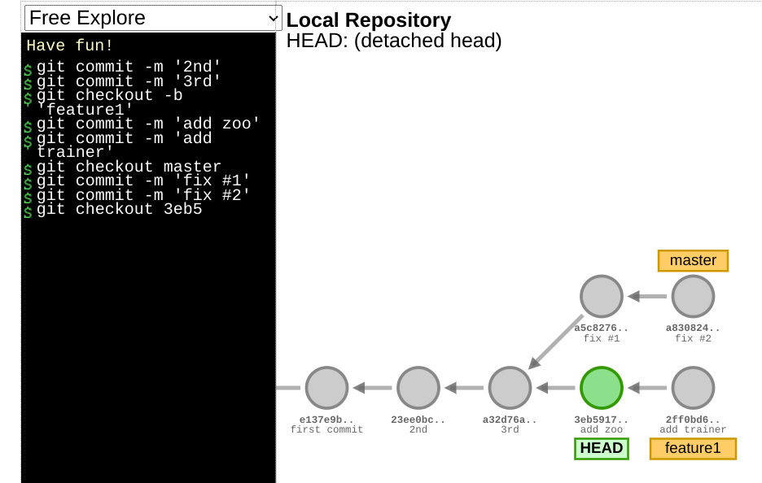

---
~
---
# Git Basics
## Concepts to know before using git 

Git stores the files as snapshot in the *local database*. 

In git, there are 3 states:

1. Modified: you have changed the file but have not committed it to your database yet
2. Staged: you have marked a modified file in its current version to go into your next commit snapshot
3. commited: the data is safely stored in your local database


## git config

### Identity

Check the repository identity
```bash
git config --list --show-origin
```

Here is the commands to change
- user.name
- user.email
- default branch

```bash
git config --global user.name "Derry"
git config --global user.email joe.doe@example.com
git config --global init.defaultBranch main
```

If need to set this identity for a specific repository, i.e. you are in a repository and you don't want to use this global config, simply skip `--global` flag.

### Global editor 

Change the editor by
```bash
git config -- global core.editor vim
```

## help

```
git <verb> help
git commit help
```

## How to think of `git add`? 

It may be helpful to think of it more as "add precisely this content to the next commit" rather than "add this file to the project".
## Working with repository

### How to create a local repository

#### Init a local repository 

In the directory and existing project:
```bash
git init
```

#### Cloning a repository 

- `git clone <url>`
- `git clone -o <cloneRemoteName> <url>` to set your clone name instead of `origin`

```bash
git clone https://www.github.com/someproject
```

- `git clone` command automatically sets up your local main branch to track the remote main branch


### Recording changes to your repository

All files in the repository can be one of two states: *tracked* and *untracked*. 

*Tracked files* are files that were in the last snapshot; they can be *unmodified, modified, or staged*. In short, *tracked files are files that Git knows about.*

*Untracked files are everything else* — any files in your working directory that were not in your last snapshot and are not in your staging area


### Checking status of your repository 

**No changes**

```bash
$ git status
On branch main

No commits yet

nothing to commit (create/copy files and use "git add" to track)
```

The output shows what branches you're on and if there's modifications made in the repository.

---

**Changes made**:

1. Create a file `README` with content `Hello World`
2. check the `git status`

```bash
$ echo "Hello World" > README
$ git status
On branch main

No commits yet

Untracked files:
  (use "git add <file>..." to include in what will be committed)
	README

nothing added to commit but untracked files present (use "git add" to track)
```

*Untracked files* means that Git sees a file you didn't have in the previous snapshot (commit), and which hasn’t yet been staged


### Tracking new files: staged 

From the previous section, we created a file `README` and now we're going to *stage* the change by `git add`

```bash 
$ git add README
$ git status
On branch main

No commits yet

Changes to be committed:
  (use "git rm --cached <file>..." to unstage)
	new file:   README
```

The file is now tracked and ready for `git commit`

--- 

Another situation: If there's file in the last commit, and also there is a file not existed in the last commit.

```bash 
$ git add .
$ git status
On branch main
Your branch is up to date with 'origin/main'.

Changes to be commited:
  (use "git reset HEAD <file>..." to unstage)
  
    modified:   new_post.py

Untracked files:
  (use "git add <file>..." to include in what will be committed)
	sites/quickstart/

no changes added to commit (use "git add" and/or "git commit -a")
```

We see *changes to be commited* and *Untracked files* section. Run `git add` will add both files to be staged and ready to commit.


### Ignore files 

Keep the files or directory you want to ignore in `.gitignore`
```
*.tmp
target/
```


### Checking the difference 

`git status` only shows what's been tracked, untracked, modified. `git diff` shows exactly the lines added or removed.

- `git diff`: compares what is in your working directory with what is in your staging area.
- `git diff --staged` (or `git diff --cached` both are synonyms): compares your staged changes to your last commit (in other words, what's staged but not commited)

---

1. Create a `README` with content "Hello World"
2. `git add README`
3. use `git diff --staged` to see what's staged but not committed (in other words, compares to the last commit)

```bash
$ git diff --staged
diff --git a/README b/README
new file mode 100644
index 0000000..557db03
--- /dev/null
+++ b/README
@@ -0,0 +1 @@
+Hello World
```


### Commit your changes 

```bash
$　git commit

# after adding the messages 

[main (root-commit) 288f9f3] adding new file README
 1 file changed, 1 insertion(+)
 create mode 100644 README
```

This will pop up the default text editor of your machine.  Add the commit messages to it and save and exit.

```bash
$ git commit -m "Inline commit messages"
```

Every time you perform a commit, you’re recording a snapshot of your project that *you can revert to or compare to later.*


### Remove files from repository 

To remove a file from git repository, you have to *remove* it from tracked files and *commit* it.

- `git rm <file>` 

```bash 
$ git rm README 
rm 'README'

$ git status
On branch main
Changes to be committed:
  (use "git restore --staged <file>..." to unstage)
	deleted:    README

$ git commit -m 'rm readme'
[main cfe54f1] rm readme
 1 file changed, 1 deletion(-)
 delete mode 100644 README
```

If you *modified the file or had already added it to the staging* area, you must *force the removal* with the `-f` option


#### Remove files from the staging area 

This is particularly useful if you forgot to add something to your `.gitignore` file and accidentally staged it, like a large log file or a bunch of .a compiled files.

- `git rm --cached <file>`

```bash
# new file readme_v2

$ git status
On branch main
Changes to be committed:
  (use "git restore --staged <file>..." to unstage)
	new file:   readme_v2

$ git rm --cached readme_v2 
rm 'readme_v2'
[derry@fed-x1 playg]$ git status
On branch main
Untracked files:
  (use "git add <file>..." to include in what will be committed)
	readme_v2

nothing added to commit but untracked files present (use "git add" to track)

```


#### Unstaged a stage file 

Since git 2.24, `git restore --staged <file>` is recommended instead of `git reset HEAD <file>`.

```bash
$ git status
On branch main
Your branch and 'origin/main' have diverged,
and have 1 and 1 different commits each, respectively.
  (use "git pull" if you want to integrate the remote branch with yours)

Changes to be committed:
  (use "git restore --staged <file>..." to unstage)
	modified:   git/git101.md

$ git restore --staged git/git101.md 

$ git status
On branch main
Your branch and 'origin/main' have diverged,
and have 1 and 1 different commits each, respectively.
  (use "git pull" if you want to integrate the remote branch with yours)

Changes not staged for commit:
  (use "git add <file>..." to update what will be committed)
  (use "git restore <file>..." to discard changes in working directory)
	modified:   git/git101.md

no changes added to commit (use "git add" and/or "git commit -a")

```

### Unmodify a modify file 

Any local changes you made to that file are gone

- `git restore <file>`

```bash 
$ git restore git/git101.md
```
=======
>>>>>>> 716c492144ef160086789c1821b858758a3cceae
## Viewing the commit history

- `git log` shows the commit history in reverse chronological order
- Use `git log --patch -<number>` to show the difference in each commit. `git log --patch -2` shows recent 2 commits
- `git log --stat` for a summary of files statistics
- `git log --no-merges` for not showing merges log

Other useful to read the git log:
- `git log --pretty=<oneline/short/full>` to shows the git logs
- `git log --graph`, you can combine with `--pretty`

|Option|Description|
|-|-|
|`--since,--after`|Limit the commits to those made after the specified date.|
|`--until, --before`|Limit the commits to those made before the specified date.|
|`--author`|shows the matched author.|
|`--commiter`|shows the matched committer|

---

```bash
$ git log
commit aafc1f3d127318805bfb6775d2fafc28a61540e3 (HEAD -> main, origin/main, origin/HEAD)
Author: derrykid <derry.career@pm.me>
Date:   Wed Dec 20 18:20:42 2023 +0800

    update git learning notes

commit 852ca297248ffab1044af27756452e2ad7c20db5
Author: derrykid <derry.yeh.dev@gmail.com>
Date:   Fri Aug 11 17:24:50 2023 +0800

    git tut
```


`git log --patch -2` shows the changes:
```bash
$ git log -p -2  # git log --patch -2
commit aafc1f3d127318805bfb6775d2fafc28a61540e3 (HEAD -> main, origin/main, origin/HEAD)
Author: derrykid <derry.career@pm.me>
Date:   Wed Dec 20 18:20:42 2023 +0800

    update git learning notes

diff --git a/git/git101.md b/git/git101.md
new file mode 100644
index 0000000..a3779a1
--- /dev/null
+++ b/git/git101.md
@@ -0,0 +1,266 @@
+## Concepts to know before using git 
+
+Git stores the file as snapshot in the *local database*. 
```

`git log --stat` shows the abbreviated stats:
```bash 
$ git log --stat -1
commit aafc1f3d127318805bfb6775d2fafc28a61540e3 (HEAD -> main, origin/main, origin/HEAD)
Author: derrykid <derry.career@pm.me>
Date:   Wed Dec 20 18:20:42 2023 +0800

    update git learning notes

 git/git101.md        | 266 +++++++++++++++++++++++++++++++
 git/images/image.png | Bin 0 -> 48889 bytes
 2 files changed, 266 insertions(+)
```

### Log graph example 

Here combines `--pretty=oneline --graph` . I only have one branch, so looks like this:
```bash
git log --pretty=oneline --graph
* 6775d2fafc28a61540e3 update git learning notes
* f27756452e2ad7c20db5 git tut
* 05f67e63db2690389961 update git branch notes
* 7d82f655ee58f4602437 update git tutorial
* ec7718da78db900c5b93 push
<<<<<<< HEAD
```


## Working with remote 

| Options | Description|
|-|-|
|`git remote -v` | shows the repo |
|`git remote show <remote>` | shows more info on remote, e.g. branches, pull, fetch info |
|`git remote add <url>` | add new remote repository |
|`git fetch` | fetch remote changes |
|`git pull` | fetch remote changes and merge |
|`git push <remote> <branch>` |commits push to remote|

### Show remote repository 

- `git remote -v` show the repositories

```bash
$ git remote 
origin 

$ git remote -v  # git remote --verbose
origin	git@github.com:derrykid/cli-tools.git (fetch)
origin	git@github.com:derrykid/cli-tools.git (push)

```

### Inspecting a remote 

- `git remote show <remote>` to see more information about a particular remote

It shows remote branches, and which *remote branches you have that have been removed from the server*, and *multiple local branches that are able to merge automatically* when run `git pull`

```bash
$ git remote show origin
* remote origin
  Fetch URL: git@github.com:derrykid/cli-tools.git
  Push  URL: git@github.com:derrykid/cli-tools.git
  HEAD branch: main
  Remote branches:
    main                      tracked
    refs/remotes/origin/miain stale (use 'git remote prune' to remove)
  Local branch configured for 'git pull':
    main merges with remote main
  Local ref configured for 'git push':
    main pushes to main (local out of date)
```

### Add remote repository 

- `git remote add <shortname> <url>`
```bash
$ git remote add pb https://github.com/paulboone/ticgit
$ git remote -v
origin https://github.com/schacon/ticgit (fetch)
origin https://github.com/schacon/ticgit (push)
pb https://github.com/paulboone/ticgit (fetch)
pb https://github.com/paulboone/ticgit (push)
```


### Fetch and pull from remote 

- `git fetch <remote>` pulls down all the data from that remote project
that you don’t have yet. *You can inspect the the project before you merge it with your local*
- `git pull` *automatically fetch and then merge that remote branch* into your current branch.

### Push to remote 

- `git push <remote> <branch>` pushes the changes to the upstream.

```bash
$ git push origin main
```

### Rename or remove remote 

```bash
$ git remote rename <remote> <newName>
$ git remote remove <remote>
```

```bash
$ git remote rename pb paul
$ git remote
origin
paul

$ git remote remove paul
$ git remote
origin
```


## Tagging 

### Show existing tags 

- `git tag` lists all existing tags
- `git tag --list <pattern>` to explicitly to search for tags

```bash
$ git tag -l "v1.8.5*"
v1.8.5
v1.8.5-rc0
v1.8.5-rc1
v1.8.5-rc2
```

### Creating tags

There are 2 tags:
- `git tag <tag>` *lightweight tag* simply stores the tag
- `git tag -a <tag> -m <message>` *annotated tag* stored as full objects in the Git. They’re checksummed; *contain the tagger name, email, and date; have a tagging message*
- `git tag -a <tag> <commitCheckSum>` to tag after commit

lightweight tag:
```bash
$ git tag v1.4-lw
$ git tag
v1.4
v1.4-lw
v1.5

$ git show v1.4-lw
commit ca82a6dff817ec66f44342007202690a93763949
Author: Scott Chacon <schacon@gee-mail.com>
Date:
Mon Mar 17 21:52:11 2008 -0700
Change version number
```

annotated tag:
```bash
$ git show v1.4
tag v1.4
Tagger: Ben Straub <ben@straub.cc>
Date:
Sat May 3 20:19:12 2014 -0700
my version 1.4
commit ca82a6dff817ec66f44342007202690a93763949
Author: Scott Chacon <schacon@gee-mail.com>
Date:
Mon Mar 17 21:52:11 2008 -0700
Change version number
```

### Push tags to remote

- `git push origin <tagname>` to push individual tag 
- `git push origin --tags` to transfer all tags to remote

Individual tag
```bash
$ git push origin v1.5
Counting objects: 14, done.
Delta compression using up to 8 threads.
Compressing objects: 100% (12/12), done.
Writing objects: 100% (14/14), 2.05 KiB | 0 bytes/s, done.
Total 14 (delta 3), reused 0 (delta 0)
To git@github.com:schacon/simplegit.git
 * [new tag] v1.5 -> v1.5
```


Push all tags
```bash
$ git push origin --tags
Counting objects: 1, done.
Writing objects: 100% (1/1), 160 bytes | 0 bytes/s, done.
Total 1 (delta 0), reused 0 (delta 0)
To git@github.com:schacon/simplegit.git
 * [new tag] v1.4 -> v1.4
 * [new tag] v1.4-lw -> v1.4-lw
```


### Delete tags 

- `git tag -d <tagname>` to remove the tag locally 
- `git push origin --delete <tagname>` to remove the tag from remote
- *Same result with*: `git push <remote> :refs/tags/<tagname>`
The way to interpret the above is to *read it as the null value before the colon is being pushed to the remote tag name*, effectively deleting it.

```bash
# delete local tag
$ git tag -d v1.4-lw
Deleted tag 'v1.4-lw' (was e7d5add)

# delete remote tag
$ git push origin :refs/tags/v1.4-lw
To /git@github.com:schacon/simplegit.git
 - [deleted] v1.4-lw
```

### Checkout tags

- `git checkout <tagname>`

This puts your repository in *detached HEAD state, which has some ill side effects*

```bash
$ git checkout v2.0.0
Note: switching to 'v2.0.0'.

You are in 'detached HEAD' state. You can look around, make experimental changes and commit them, and you can discard any commits you make in this state without impacting any branches by performing another checkout.

...
```

In "detached HEAD" state, *if you make changes and then create a commit, the tag will stay the same*. Thus, if you need to make changes — say you’re fixing a bug on an older version, for instance — *you will generally want to create a branch*:
```bash
$ git checkout -b version2 v2.0.0
Switched to a new branch 'version2'
```

If you do this and make a commit, your `version2` branch will be slightly different than your `v2.0.0` tag since it will move forward with your new changes, so do be careful.


## Git alias 

You can set up alias to automatically infer your commands. 


```bash
$ git config --global alias.ci commit

# now you can run your alias as follow
$ git ci 
```

It's useful to come up with like to *unstage* your file:
```bash
$ git config --global alias.unstage 'reset HEAD --'

$ git unstage fileA
$ git reset HEAD -- fileA
```

Or see the last log message:
```bash
$ git config --global alias.last 'log -1 HEAD'

$ git last
```


# Git branching

> Check pro git p.63


## Branching in nutshell

When you make a commit, Git *stores a commit object that contains a pointer to the snapshot of the content you staged.*

This object also *contains* the author’s name and email address, the *message that you typed, and pointers to the commit or commits that directly came before this commit* (its parent or parents): 
- zero parents for the initial commit
- one parent for a normal commit
- multiple parents for a commit that results from a merge of two or more branches.


Example: 3 files in the repository
```
$ git add README test.rb LICENSE
$ git commit -m 'Initial commit'
```

Git repository now contains five objects: 
- three blobs (each representing the *contents of files*)
- one tree that *lists the contents of the directory* and specifies which *file names are stored as which blobs*
- one commit with *the pointer to that root tree and all the commit metadata.*


If you *make some changes and commit again*, the *next commit stores a pointer to the commit* that came immediately before it


A branch in Git is simply a *lightweight movable pointer* to one of these commits.

## What is HEAD

How does Git know what branch you’re currently on? It keeps a special pointer called *HEAD.*

- `git log --oneline --decorate` to see where *HEAD* points to


In this graph, we have 3 commits. Each commit points to the parent commit. 

Currently we're at branch `master`. It's also tagged `v1.0`. The *HEAD* pointer points to the master branch.

```bash
$ git log --oneline --decorate
f30ab (HEAD -> master, testing) ......
```

### Detached HEAD state

The detached HEAD state occurs when *the HEAD does not point to a branch, but instead points to a specific commit or the remote repository.*

In this graph, the HEAD is not point at `master` nor `feature1`. It's in detached HEAD state.


To save changes in detached HEAD state:
1. Create a new branch
2. Commit the changes
3. Merge the changes

## Creating a new branch

- `git branch <branchName>` create a new branch 

```bash
$ git branch testing
```
It creates a new branch `testing`. Illustrated as below. Since we did not switch to `testing` branch, the *HEAD* still points to `master`.


## Show existing branches 

- `git branch` shows all branches 
```bash
$ git branch
  iss01
  feature101
* main
```

### Show branches last commit

- `git branch -v` 

```bash
$ git branch -v       # git branch --verbose
  iss01    da85ad3 fixing bug #1
  javaBack d5bea49 Add java program to backend
* main     da85ad3 fixing bug #1
```

### Show the merged and unmerged branches 

- `git branch --merged`
- `git branch --no-merged`

Generally, the branches show up by `git branch --merged` is fine to delete:
```bash
$ git branch --merged
iss53
* master
```
We already merged the `iss53` with `master` so it shows up here. `iss53` is fine to delete by `git branch -d <localBranch>`

--- 

*Merged* example: I have a `main` branch, I create branch `iss01` and fast-forward merge both branches.

Show the merged branches:
```bash
$ git branch -v
  iss01    da85ad3 fixing bug #1
  javaBack d5bea49 Add java program to backend
* main     da85ad3 fixing bug #1

$ git branch --merged 
  iss01
* main
```


Because I already merged in `iss01` earlier, you see it in your list. Branches on this list without the `*` in front of them are generally fine to delete

---

*No merged* example: I create a new branch `testing` but have not merged with `main` yet.

```bash 
$ git branch --no-merged
testing
```

If I try to delete the unmerged branch:
```bash
$ git branch -d testing
error: The branch 'testing' is not fully merged.
If you are sure you want to delete it, run 'git branch -D testing'.
```


## Switch branches

- `git checkout <branchName>` to switch branches

```bash 
$ git checkout testing
```

Followed by previous, the *HEAD* now points to the `testing` branch.


Let's modify the file and commit.
```bash 
$ vim test.rb
$ git commit -a -m 'Make a change'
```


## Merging 

- If on `main`, `git merge <branch>` merges the target branch with current branch.

---

Scenario: Working on a website

> Example from pro git p.70

1. Do some work on a website.
2. Create a branch `iss53` for a new user story you’re working on.
3. Do some work in that branch.

At this stage, you’ll receive a call that another issue is critical and you need a hotfix. You’ll do the following:

1. Switch to your production branch `main`.
2. Create a branch to add the `hotfix`.
3. After it’s tested, merge the `hotfix` branch, and push to production.
4. Switch back to your original user story and continue working.


```bash
$ git branch issu53     # can use shorthand 
$ git checkout issu53   # git checkout -b issu53

$ vim index.html
$ git commit -a -m 'add new footer [issu53]'
```

The graph should look like this. *In the book, it uses master instead of main*


Now we're getting a call and need to do a hotfix. 
```bash
$ git checkout -b hotfix
Switched to a new branch 'hotfix'

$ vim index.html
$ git commit -a -m 'Fix broken email address'
```

After these commands, the graph should look like this:


Lastly, we want to merge the `main`(here is `master`) branch with `hotfix`.

```bash
$ git checkout main 
$ git merge hotfix
Updating f42c576..3a0874c
 Fast-forward
 index.html | 2 ++
 1 file changed, 2 insertions(+)
```

**Notice it says "fast-forward".** It will explain in next session. After the merge, it will look like this:


### What is fast-forward?

When you try to *merge one commit with a commit that can be reached by following the first commit's history*, Git simplifies things *by moving the pointer forward* because there is no divergent work to merge together — this is called a *fast- forward.*

Look at the following graph. We are on `master` branch, and we merge with `hotfit` branch. It's *fast-forward.*

```bash
$ git checkout master 
$ git merge hotfix
Updating f42c576..3a0874c
 Fast-forward
 index.html | 2 ++
 1 file changed, 2 insertions(+)
```


### Basic merging

Suppose the work we're working on branch `iss53` is good and we made commit. 


Now we want to merge our `iss53` branch with `master`.

```bash
$ git checkout master
Switched to branch 'master'

$ git merge iss53
Merge made by the 'recursive' strategy.
index.html | 1 +
1 file changed, 1 insertion(+)
```

**Notice here says 'recursive' strategy.** 

Your development *history has diverged* from some older point.

Because the *commit on the branch you're on isn't a direct ancestor of the branch you're merging in*, Git has to do some work. In this case, Git does a simple three-way merge, using the *two snapshots pointed to by the branch tips and the common ancestor of the two.*


Instead of just moving the branch pointer forward, *Git creates a new snapshot that results from this three-way merge and automatically creates a new commit that points to it*. 

This is referred to as a merge commit, and is special in that it has *more than one parent.*


Lastly, we can safely delete branch `iss53`
```
$ git branch -d iss53
```

## Rebase branches

*Rebase branches is another way to merge branches*. I'll have a cleaner git history but comes with drawbacks. To read more about drawbacks on rebasing, read *pro git p.100*

1. `git checkout <theInBranch>`
2. `git rebase <targetBranch>`
3. `git checkout <theInBranch>`
4. `git merget <targetBranch>`

---

Instead of merging history like:


The rebasing history is like this:


We will rebase the `master` based on `experiment`
```bash
$ git checkout experiment
$ git rebase master
First, rewinding head to replay your work on top of it...
Applying: added staged command

$ git checkout master
$ git merge experiment
```


## Move branches back to previous commits 

What if you accidentally move forward your `main` to the newest commits? Usually the `main`, assume `prod`, is behind the latest commits.

- `git branch -f <branch> <commit>` will move the branch to the commits we specify

Example: move the `main` to `C1`
```bash
# on branch bugFix
$ git branch -f main C1

# or we can use ^ or ~
$ git branch -f main HEAD~3
```


## Cherry-pick

It is like a rebase for a single commit. 

It takes the patch that was *introduced in a commit and tries to reapply it on the branch you’re currently on.*

This is useful if you have a number of commits on a topic branch and you want to *integrate only one of them*, or if you only have one commit on a topic branch and you’d prefer to cherry-pick it rather than run rebase.

- `git cherry-pick <commit>`

Example: `master` branch only wants the changes in `e43a6` commits

```bash
# on master branch
$ git cherry-pick e43a6
Finished one cherry-pick.
[master]: created a0a41a9: "More friendly message when locking the index fails."
 3 files changed, 17 insertions(+), 3 deletions(-)
```


## Delete branch 

- `git branch -d <branchname>`


## Merge conflict 

Scenario, we're on branch `master`. We want to merge `iss53` now. 

```bash
$ git checkout master 
$ git merge iss53
Auto-merging index.html
CONFLICT (content): Merge conflict in index.html
Automatic merge failed; fix conflicts and then commit the result.
```

The merge conflict messages appeared. If we want to *see what files are not merged. We can run `git status`*

```bash
$ git status
On branch master
You have unmerged paths.
  (fix conflicts and run "git commit")
Unmerged paths:
  (use "git add <file>..." to mark resolution)
  
    both modified: index.html

no changes added to commit (use "git add" and/or "git commit -a")
```

Anything that has *merge conflicts and hasn't been resolved is listed as unmerged. Git adds standard conflict-resolution markers to the files that have conflicts*, so you can *open them manually and resolve those conflicts*. 

Your file contains a section that looks something like this:
```
<<<<<<< HEAD:index.html
<div id="footer">contact : email.support@github.com</div>
=======
<div id="footer">
please contact us at support@github.com
</div>
>>>>>>> iss53:index.html
```

This means the version in `HEAD` (your `master` branch, because that was what you had checked out when you ran your merge command) is the top part of that block (everything above the `=======`), while the version in your `iss53` branch looks like everything in the bottom part.

We can remove the lines `<<<< ===== >>>>` and resolve the merge conflicts:
```html
<div id="footer">
please contact us at email.support@github.com
</div>
```

After we resolve the conflict, we can run `git add` to mark it as resolved. 

```bash 
$ git add .
$ git commit -m 'merge iss53'

$ git branch -d iss53
```

## Change the branch name 

- `git branch --move <oldBranchName> <newBranchName>`

---

To change the branch name and push to remote, do:
1. `git branch --move <oldBranchName> <newBranchName>`
2. `git push --set-upstream origin <newBranchName>`
3. `git push origin --delete <oldBranchName>`

Example: modify the local branch name also push to remote repository

1. This only applies changes to local
```bash
$ git branch --move bad-branch-name corrected-branch-name
```

2. To also change the remote repository after running the that, you need to run this:
```bash 
$ git push --set-upstream origin corrected-branch-name

$ git branch --all
* corrected-branch-name
	main
	remotes/origin/bad-branch-name
	remotes/origin/corrected-branch-name
	remotes/origin/main
```

Notice that you’re on the branch `corrected-branch-name` and it’s available on the remote. However, the branch with the `bad-branch-name` is also still present there but you can *delete* it by executing the following command

3. Delete the remote branch
```bash
$ git push origin --delete bad-branch-name
```


### Change the master / main branch name

Follow the same steps in the previous section to change the master / main branch name. However, do mind the following before the change:

- Any projects that depend on this one will need to update their code and/or configuration.
- Update any test-runner configuration files.
- Adjust build and release scripts.
- Redirect settings on your repo host for things like the repo’s default branch, merge rules, and other things that match branch names.
- Update references to the old branch in documentation.
- Close or merge any pull requests that target the old branch.

## Git remote branch

### Add remote repository 

- `git remote add <remoteName> <url>`

```bash
$ git remote add myGitServer git://git.server/hoster
```

### Show the remote servers

- `git remote show <remote>` shows the branches on the remote server 


If nothing new:
```bash
$ git remote show origin
Warning: Permanently added the ECDSA host key for IP address '140.82.114.3' to the list of known hosts.
* remote origin
  Fetch URL: git@github.com:derrykid/repo-demo.git
  Push  URL: git@github.com:derrykid/repo-demo.git
  HEAD branch: main
  Remote branch:
    main tracked
  Local ref configured for 'git push':
    main pushes to main (up to date)
```

**Notice that there's new branch `feature01`** in the message
```bash
$ git remote show origin
* remote origin
  Fetch URL: git@github.com:derrykid/repo-demo.git
  Push  URL: git@github.com:derrykid/repo-demo.git
  HEAD branch: main
  Remote branches:
    feature01 new (next fetch will store in remotes/origin)
    main      tracked
  Local ref configured for 'git push':
    main pushes to main (up to date)
```


### Sync with remote server

Updates on the remote repository is not synchronized unless we fetch the data.

- `git fetch <remote>` fetches the data from the remote repository and update the local git database 
- `git fetch --all` to pull all the remote branches

```bash
$ git fetch origin
remote: Enumerating objects: 4, done.
remote: Counting objects: 100% (4/4), done.
remote: Compressing objects: 100% (3/3), done.
remote: Total 3 (delta 0), reused 0 (delta 0), pack-reused 0
Unpacking objects: 100% (3/3), 736 bytes | 184.00 KiB/s, done.
From github.com:derrykid/repo-demo
 * [new branch]      feature01  -> origin/feature01
```

### Merge with remote serve branches 

From the previous section, we know we can pull changes by `git fetch <remote>`. 

- `git merge <remote>/<remoteBranchName>`

For example to merge the `main`
```bash
$ git fetch origin main 

$ git branch
*main 
 feature01

$ git merge origin/main
```

### Show what branch the local tracks 

- `git remote show <remote>`
- `git branch -vv` also shows the verbose version

In this example, local `main` is pushes `remote/main`
```bash
$ git remote show origin 
* remote origin
  Fetch URL: git@github.com:derrykid/repo-demo.git
  Push  URL: git@github.com:derrykid/repo-demo.git
  HEAD branch: main
  Remote branches:
    bugfix#1  tracked
    feature01 tracked
    main      tracked
  Local branch configured for 'git pull':
    bugfix#1 merges with remote bugfix#1
  Local refs configured for 'git push':
    bugfix#1 pushes to bugfix#1 (up to date)
    main     pushes to main     (local out of date)
```

Or use `git branch -vv`. This shows the local `main` up-stream is `origin/main`.
```bash
$ git branch -vv
  bugfix#1 bcde85c [origin/bugfix#1] Create bugReport
* main     33a90d9 [origin/main] Merge pull request #1 from derrykid/feature01
```

### Pushing to remote branches

- `git push <remote> <localBranch>` pushes local branch to remote
- `git push --all` pushes all local branches

This pushes local branch `main`. As long as you set the upstream, it will be fine.
```bash
$ git push origin main
```

It's shortcut, actually the full command should be like:
- `git push <remote> <localBranch>:<remoteBranch>`
```bash
$ git push origin refs/heads/serverfix:refs/heads/serverfix

# or shorter
$ git push origin serverfix:serverfix
```

### Tracking branch: fetch and work on the remote branch

*A local branch tracks a remote branch is called tracking branch.* The remote branch it tracks is called an *upstream branch*.

When we're working on a local branch *which has a upstream branch*, `git pull` knows where it fetches the code and merges.

The remote branches will not be created as local branch by default. So we have to run commands to creates it:

3 variations
- `git checkout -b <branch> <remote>/<remoteBranch>`
- `git checkout --track <remote>/<remoteBranch>`
- `git checkout <remoteBranch>` even shorter if you don't have a local branch with the name and there's remote branch matches the name

#### I don't see the remote branches when I run git fetch

When we fetch the remote, the new branches will not be created locally but is stored as `<remote>/<branchName>`.  

If we want to see the data, we have to do `git branch <remoteBranchName>`. This will create the branch locally.

--- 


For example: At local, we only have a branch `main`, while the remote has more branches `feature01` and `bugfix#1`
```bash
$ git branch
* main

$ git remote show origin
* remote origin
  Fetch URL: git@github.com:derrykid/repo-demo.git
  Push  URL: git@github.com:derrykid/repo-demo.git
  HEAD branch: main
  Remote branches:
    bugfix#1  new (next fetch will store in remotes/origin)
    feature01 tracked
    main      tracked
  Local ref configured for 'git push':
    main pushes to main (local out of date)
```


We have to *fetch the remote.* It'll be stored locally as `<remote>/<branchName>` when we run `git branch --all`:
```bash
$ git fetch origin

$ git branch        # only shows the local
* main

$ git branch --all  # shows the remote branches
* main
  remotes/origin/bugfix#1
  remotes/origin/feature01
  remotes/origin/main
```

To checkout the remote branch as a local branch, *we have to explicitly create the branch and set upstream*:
```bash
# syntax
$ git checkout -b localBranchName origin/remoteBranchName

$ git checkout -b bugfix#1 origin/bugfix#1
```

Now you can simply run `git checkout <remoteBranch>`, it's default behaviour:
```bash
$ git checkout bugfix#1
Branch 'bugfix#1' set up to track remote branch 'bugfix#1' from 'origin'.
Switched to a new branch 'bugfix#1'
```


### Delete remote branch 

- `git push <remote> --delete <remoteBranch>`

```bash
$ git push origin --delete feature01
```


# Git reset and revert


## Local branches 

To set a local branch to the old commits

- `git reset <commit>` resets the current branch to the commit

```bash 
# now we're at 33a9
$ git log --oneline --graph 
*   33a90d9 (HEAD -> main, origin/main) Merge pull request 
|\  
| * 7b40405 (origin/feature01, feature01) 
|/  
* 2eceff4 first commit


$ git reset HEAD^

# now we're at 2ec2ff4, the ^ commit
$ git log --oneline --graph 
* 2eceff4 (HEAD -> main) first commit
```


## Remote branch 

Use the `git revert` will actually create a new commit that use the previous commit.

- `git revert <branch>` creates new commit with the message *Revert [commit message]*

```bash 
# current at the main branch 

# revert 1 commit 
$ git revert HEAD
[main 962d6dd] Revert "new commit after merge"
 1 file changed, 1 deletion(-)
```