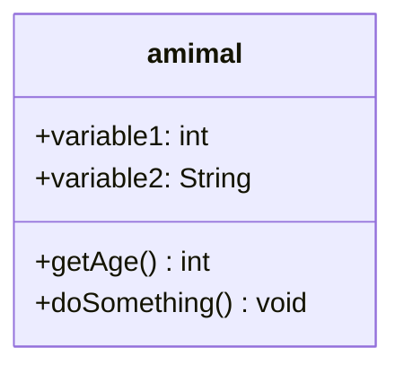
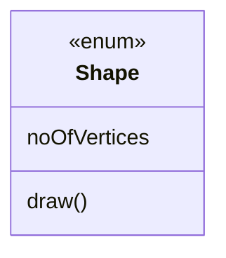
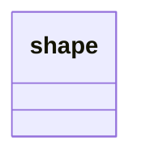
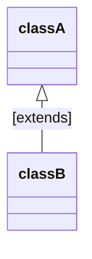
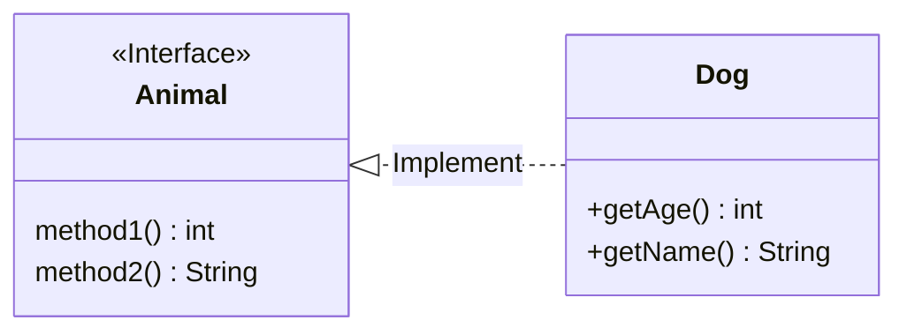

[toc]

# Syntax
[Syntax sheet](https://mermaid-js.github.io/mermaid/#/classDiagram) 

## Define a class

## Accessibility

- `+` public
- `-` private
- `#` protected
- `~` package

## Relation

| Type   | Description                 |
|--------|-----------------------------|
| ..\|>  | Implemetation / realization |
| - -\|> | Inheritance / extend        |

## Annotation on class

- <\<Interface>>
- <\<abstract>>
- <\<enum>> or <\<enumeration>>

## Comment

## Label on relation
classA <|-- classB: [lable]

## Setting the direction

